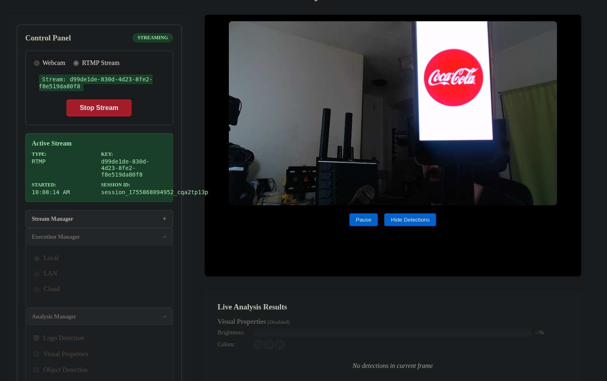
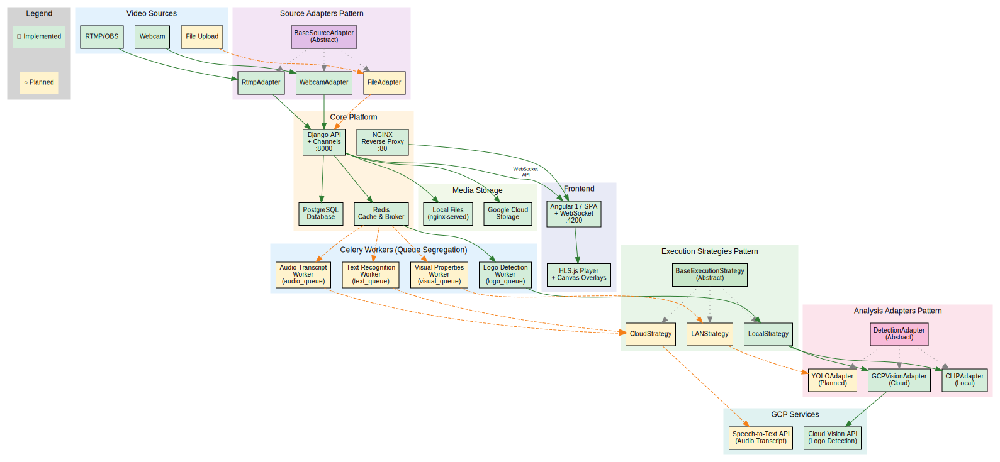

# Real-Time Video AI Analysis Platform



A production-ready video streaming platform with real-time AI logo detection, demonstrating scalable microservices architecture and modern web technologies.

## Quick Demo

```bash
docker compose up
```

**Test the system:**
1. Open http://localhost:3000 (frontend)
2. Start webcam stream or use RTMP from OBS
3. Show logos from `/logos/` folder to camera for real-time detection
4. Watch live detection results and visual overlays

## Architecture Overview



**Key Design Patterns:**

- **Source Adapters** (`streaming/source_adapters.py`) - Abstract webcam vs RTMP input
- **Execution Strategies** (`ai_processing/execution_strategies/`) - Local vs distributed processing  
- **Analysis Adapters** (`ai_processing/adapters/`) - Pluggable AI models (CLIP, GCP Vision)
- **Queue Segregation** - Separate Celery workers for different analysis types

## Code Organization

```
├── backend/
│   ├── streaming/           # Video ingestion (RTMP/Webcam)
│   ├── ai_processing/       # AI analysis pipeline
│   │   ├── adapters/        # Pluggable AI models
│   │   ├── execution_strategies/  # Local/cloud/distributed
│   │   └── tasks.py         # Celery workers
│   └── effects/             # Real-time video effects (future)
├── frontend/                # Angular 17+ SPA
├── k8s/                     # Kubernetes manifests
└── logos/                   # Test images (Apple, Nike, etc.)
```

## Tech Stack

- **Backend**: Django + Channels, Celery, PostgreSQL, Redis
- **AI/ML**: PyTorch + CLIP, OpenCV, GCP Vision API
- **Frontend**: Angular 17, WebSockets, HLS.js
- **Infrastructure**: Docker, Kubernetes, NGINX

## Features Implemented

✅ **Real-time logo detection** (CLIP + GCP Vision)  
✅ **Live video streaming** (webcam/RTMP → HLS)  
✅ **WebSocket overlays** (detection boxes, confidence scores)  
✅ **Kubernetes deployment** (auto-scaling, health checks)  
✅ **Modular architecture** (adapters, strategies, queues)  

🔄 **In progress**: Visual properties, audio transcription, distributed processing

---

*This project demonstrates full-stack capabilities: AI/ML integration, real-time systems, cloud-native architecture, and modern web development.*