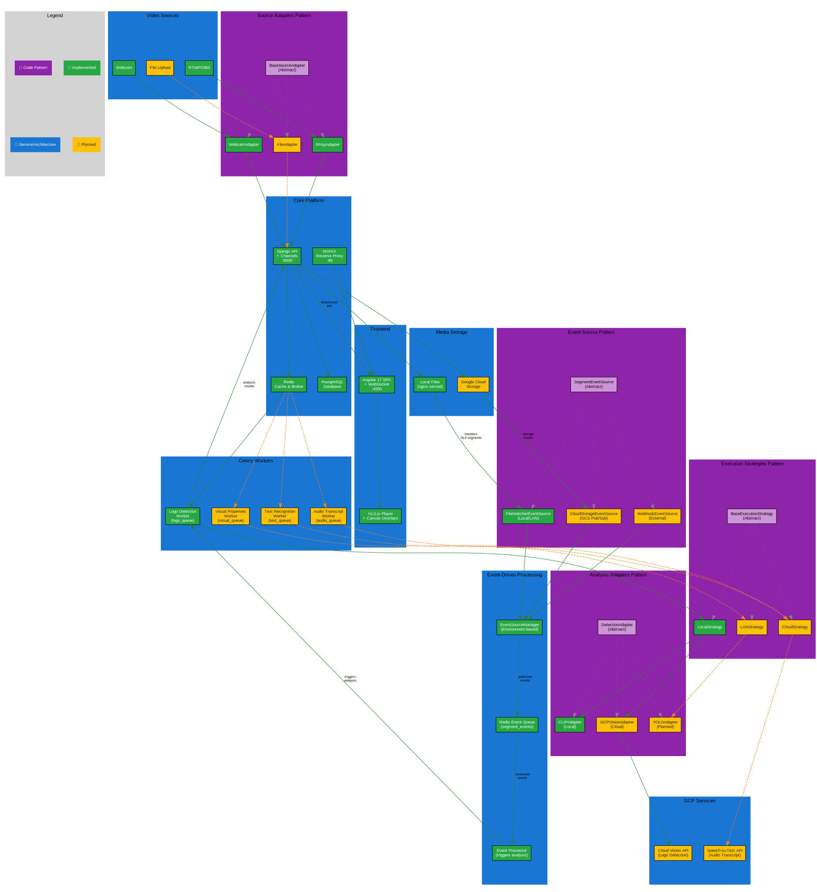

# Real-Time Video AI Analysis Platform


A production-ready video streaming platform with real-time AI logo detection, demonstrating scalable microservices architecture and modern web technologies.

## Quick Demo

```bash
docker compose up
```

**Test the system:**
1. Open http://localhost:3000 (frontend)
2. Start webcam stream or use RTMP from OBS
3. Show logos from `/logos/` folder to camera for real-time detection
4. Watch live detection results and visual overlays

## Architecture Overview



## Tech Stack

- **Backend**: Django + Channels, Celery, PostgreSQL, Redis
- **AI/ML**: PyTorch + CLIP, OpenCV
- **Frontend**: Angular 17, WebSockets, HLS.js
- **Infrastructure**: Docker, Kubernetes, NGINX

---

*This project aims to demonstrate full-stack capabilities: AI/ML integration, real-time systems, cloud-native architecture, and modern web development.*